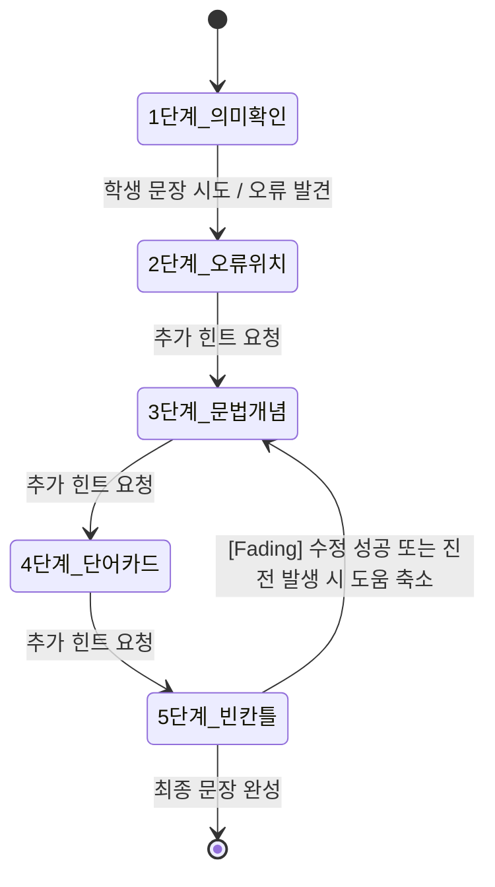

# 영어 작문 AI 스캐폴딩 튜터 - 제품 요구사항 정의서 (PRD)

본 문서는 영어 작문 교육 최신 연구 동향(지능형 튜터링 시스템, Fading 스캐폴딩, 과의존 방지, 피드백 리터러시)을 통합하여 설계된 **영어 작문 AI 스캐폴딩 튜터(English Writing Scaffold Tutor)**의 제품 요구사항 정의서(PRD)입니다.

---

## 1. 프로젝트 개요

### 1.1 프로젝트명
* **영어 작문 AI 스캐폴딩 튜터 (English Writing Scaffold Tutor)**

### 1.2 프로젝트 목적
본 시스템은 완성형 정답 번역문을 학습자에게 단순히 주입하는 기존의 자동 작문 첨삭기(AWE) 모델에서 벗어나, 학습자가 스스로 영어 문장을 생각하고 작성해 나갈 수 있도록 **진단 ➡️ 힌트 ➡️ 재시도 ➡️ 반성 ➡️ 점진적 지원 축소(Fading)**를 유도하는 지능형 튜터링 시스템(ITS)을 구축하는 것을 목적으로 합니다.

### 1.3 핵심 철학
1. **정답 직접 제시 절대 금지**: AI는 완성된 정답 문장을 학생에게 절대 노출하지 않습니다.
2. **스캐폴딩 기반의 조력과 Fading (도움 줄이기)**: 학생이 막힐 때만 점진적으로 힌트를 강화하되, 학생의 이해도가 올라가거나 수정에 성공하면 즉시 도움 강도를 낮추어 최종 문장은 반드시 학생 스스로 완성하게 합니다.
3. **피드백 리터러시와 자기반성**: 학생이 힌트를 통해 스스로 수정한 과정을 인지하고 내재화하도록 지원합니다.
4. **교사의 보완적 모니터링**: AI 튜터링의 사각지대(과의존 학생, 반복 오류 학생)를 교사가 실시간으로 포착하고 개입할 수 있도록 돕습니다.

### 1.4 핵심 아키텍처 (ITS 구조)
본 시스템은 ITS 연구의 4대 핵심 요소를 유기적으로 연결하여 설계합니다.

```text
[ 학생 입력 ] ➡️ [ UI Model (작문창, 실시간 Diff) ] 
                     ⬇️ ⬆️
             [ Tutor Model (정답 방지, 힌트 수위 제어) ] 
                     ⬇️ ⬆️
             [ Student Model (오류 이력, 힌트 의존성) ]
                     ⬇️ ⬆️
             [ Domain Model (교육과정, 어휘/문법 기준) ]
```

| ITS 요소 | 시스템 내 구현 정의 |
| :--- | :--- |
| **Domain Model (도메인 모델)** | 대한민국 교육부 초등 영어 성취 기준, 학년별 필수 어휘/문법 데이터, AI 튜터링 프롬프트 규칙 및 정답 차단 정책 |
| **Student Model (학생 모델)** | 학생 기본 정보(학년, 반, 이름, 수준) 및 동적 학습 데이터(힌트 요청 단계, 누적 오류 카테고리, 수정 횟수, 과의존 플래그) |
| **Tutor Model (튜터 모델)** | 동적 스캐폴딩 단계(1~5단계) 전환 규칙, 힌트 생성 프롬프트 빌더, 피드백 제어 및 과의존 감지 알고리즘, 출력 검증기 |
| **User Interface (UI 모델)** | 작문 입력 영역, 힌트 카드 및 단어 칩, 실시간 수정 이력(Diff) 시각화 뷰, 자기반성문 입력란, 교사용 대시보드 |

---

## 2. 핵심 기능 정의

### 2.1 학생 설정 및 로그인 우회 (MVP)
* 학년, 반, 이름 입력
* 난이도 레벨 설정 (초등 3~4학년 / 초등 5~6학년 / 중학생 / 고등학생)
* 표현하고자 하는 우리말 문장 입력
* 기존 동명이인 학생 정보 존재 시, 기존 `student_id`를 재사용하며 선택한 난이도로 프로필 정보를 동적으로 업데이트합니다.

### 2.2 동적 스캐폴딩 5단계 힌트 제어 규칙 (Scaffolding & Fading)
학생이 문장을 입력하거나 "힌트 더 받기"를 요청할 때, 튜터 정책 엔진은 아래의 힌트를 제공합니다. 단, 학생이 다음 문장을 입력하거나 직접 고쳐보기 전에는 다음 힌트 단계로 넘어가는 것이 잠깁니다.



1. **1단계 (의미 확인 - Basic)**
   * 영어 문장을 일절 배제한 채 문장 속 주체("누가"), 행위("무엇을 하는지"), 배경("어디서/언제") 등 의미 구조를 한글로 파악하도록 돕습니다.
2. **2단계 (오류 위치 표시)**
   * 학생이 첫 문장을 시도한 후, 틀린 단어가 있는 위치를 가리켜 줍니다 (예: "세 번째 단어 부근의 형태를 다시 확인해보세요").
3. **3단계 (문법 개념 힌트)**
   * 문법적으로 보완해야 할 개념을 설명합니다 (예: "어제 일어난 일이니, 동사 뒤에 -ed를 붙여서 과거형으로 써봐요").
4. **4단계 (단어 카드 제시)**
   * 문장에 필요한 핵심 어휘(예: play, yesterday 등)를 단어 카드 형태로 동적으로 제공합니다.
5. **5단계 (빈칸 문장틀 - Scaffolding Frame)**
   * 학생이 최종적으로 문장을 완성할 수 있도록 핵심 부분을 빈칸으로 둔 뼈대를 제공합니다 (예: `I + play__ + soccer + yesterday.`).

#### 🔄 동적 Fading (도움 줄이기) 알고리즘
* **규칙**: 학생이 4~5단계의 높은 수준 힌트를 적용하여 문장을 수정한 결과, 이전에 틀렸던 핵심 오류를 고쳤거나 문장 유사도가 정답에 가까워진 경우(진전이 있는 경우), AI는 다음 피드백 턴에서 힌트 강도를 2~3단계(오류 위치 또는 가벼운 문법 힌트)로 즉시 강등시켜 스스로 힘으로 완성하도록 책임을 점진적으로 이양(Transfer of responsibility)합니다.

---

### 2.3 AI 튜터 피드백 규격 및 출력 검증기 (Output Validator)

#### ① Hattie & Timperley 피드백 모델 기반 프롬프트
AI 튜터는 학생에게 단순한 평가 문장을 제공하지 않고, 다음 3가지 핵심 질문에 기반하여 피드백을 구조화합니다.
1. **Where am I going (목표)**: 학생이 표현하려는 우리말 문장의 원래 의도 상기.
2. **How am I going (현재)**: 현재 작성된 학생 문장의 장점과 누락/오류 요소 진단.
3. **Where to next (다음 행동)**: 스스로 다음 문장을 수정해볼 수 있는 구체적인 비평가적 단서(힌트) 제공.

#### ② 출력 검증기 (Output Validator) 및 안전장치
* **완성형 영어 정답 차단**: AI의 응답 텍스트에 영어 완성 문장이 포함되어 나가는 것을 정규식과 키워드(예: "정답은", "The correct sentence is" 등) 기반으로 전면 차단합니다. 차단 작동 시 대체 문구("정답을 바로 알려주지는 않을게요. 대신 네가 직접 완성할 수 있도록 힌트를 줄게요.")로 자동 치환합니다.
* **텍스트 제한 (하위권 학생 배려)**: AI의 답변 길이를 문단당 최대 3줄(한글 설명 기준) 이내로 제약하여 초등학생의 텍스트 피로도 및 동기 저하를 방지합니다.
* **수준 제약 필터**: 학년별 수준을 초과하는 어려운 문법 용어(예: 초등 3~4학년에게 '동명사', '관계대명사' 등)의 노출을 금지하고, 쉬운 한글 대체 단어("~하는 행동", "~을 꾸며주는 말")로 번역하여 제공합니다.

---

### 2.4 실시간 수정 이력 시각화 (UI Model)
* **단어 단위 Diff 렌더링**: 학생이 힌트를 기반으로 문장을 고쳐 쓸 때마다 이전 입력문과 현재 입력문을 대조하여 문장 수준의 수정 유형을 색상으로 시각화합니다.
  - **추가된 단어**: 초록색 하이라이트
  - **삭제된 단어**: 빨간색 취소선
  - **수정/유지된 단어**: 회색 또는 파란색
* 학생이 자신의 오류 수정 행위와 문장 변화를 메타인지적으로 인지할 수 있도록 대화창 상단 혹은 별도 비교 영역에 고정 노출합니다.

---

### 2.5 과의존 탐지 (Overdependence Detection)
* **정의**: 학습자가 스스로 고민하지 않고 AI가 제공하는 힌트만 기계적으로 받아 적는 현상을 포착합니다.
* **판단 기준**: 한 작문 세션 내에서 **4단계(단어 카드) 또는 5단계(빈칸 문장틀)의 고강도 힌트를 연속 2회 이상 사용**한 경우.
* **처치**:
  - 해당 세션 데이터의 `is_overdependent` 컬럼 값을 `TRUE`로 기록합니다.
  - 교사 대시보드 화면에서 해당 학생의 세션 카드 옆에 ⚠️ 과의존 경고 플래그를 가시적으로 노출합니다.

---

### 2.6 피드백 리터러시 (자기점검 및 반성 루프)
* 작문 성공 판정을 받아 세션이 완료되기 전, **반성 행동(Reflection)** 단계를 필수로 거치게 합니다.
* 초등 학습자의 피로도를 낮추고 직관적인 인지적 반성을 돕기 위해, **선택형 성장 태그 카드 클릭 방식**을 전면 도입합니다.
* **성장 태그 카드 선택지**:
  1. `어휘 성장 (vocabulary)`: "새로운 영어 단어를 알게 되었어요! 🔤"
  2. `어순 정복 (word_order)`: "영어 문장을 만드는 순서(어순)를 배웠어요! 🧩"
  3. `문법 이해 (grammar)`: "시간에 맞게 단어 모양(과거형 -ed 등)을 바꾸는 법을 배웠어요! ⏰"
  4. `유능감 뱃지 (confidence)`: "스스로 고쳐 써서 끝까지 내 힘으로 완성해서 뿌듯해요! 💪"
* 학생은 성장 카드를 최소 1개 이상 클릭하여 선택해야 완료할 수 있습니다. 
* 추가로 하고 싶은 말이 있는 경우에만 "직접 쓸래요" 버튼을 활성화하여 한 줄 주관식 소감(`reflection_text`)을 선택적으로 입력할 수 있게 합니다.

---

### 2.7 교사 대시보드 (`/teacher`)
교사가 전체 학급 학생들의 학습 진행률과 AI 튜터링의 사각지대(과의존 학생, 실패 학생)를 관찰하고 피드백 리터러시를 수집할 수 있는 화면을 제공합니다.
* **인적 사항 및 기본 지표**: 학생 이름, 학년/반, 누적 작문 도전 횟수, 평균 수정(Revision) 횟수.
* **과의존 탐지 알림**: `is_overdependent` 플래그가 참인 학생 레코드를 빨간색 테두리 또는 경고 아이콘(⚠️)으로 최상단 강조 표시.
* **주요 오류 및 성장 분석**: 
  - 학생별 자주 유발되는 오류 카테고리 시각화.
  - **학급 전체의 성장 태그 선택 분포 통계 차트** (예: 어순 정복 40%, 어휘 성장 30% 등) 시각화 제공.
* **반성 일지 모아보기**: 각 학생이 선택한 성장 태그(`reflection_tags`) 목록 및 선택적 주관식 소감(`reflection_text`) 리스트 확인 가능.
* **수집 뱃지 도감**: 학생별 획득한 누적 뱃지 목록을 아이콘 형태로 가시화하여 제공.

---

### 2.8 성장 뱃지 시스템 (Badge System)
학습자가 작문을 완료할 때마다 그 과정과 누적 데이터를 분석하여 동기를 부여하는 뱃지를 자동으로 지급하고 누적 적재합니다.

* **뱃지 5종 종류 및 지급 기준**:
  1. **끈기 대장 뱃지 (persistence_master) 🏅**: 한 세션 내 문장 수정(Revision) 횟수가 **4회 이상**일 때 지급 (포기하지 않는 도전 장려).
  2. **어휘 탐험가 뱃지 (word_explorer) 🔤**: 완성 문장에 **6글자 이상의 영어 단어가 3개 이상** 포함되었을 때 지급 (다양한 표현 시도 촉진).
  3. **스스로 일어서기 뱃지 (self_reliant) 🚀**: 세션 중 **과의존 플래그가 켜지지 않고(false), 4~5단계 고강도 힌트를 1회 이하**로 사용하여 완성했을 때 지급 (자립성 보상).
  4. **차근차근 성장 뱃지 (steady_builder) 🌱**: **누적 완료 세션 수가 3회, 5회, 10회**에 도달하는 시점에 각각 지급 (지속적 학습 습관 보상).
  5. **성장 메아리 뱃지 (active_reflector) 💬**: "직접 소감을 남길래요"를 작성하여 주관식 소감(`reflection_text`)을 **30자 이상** 성실하게 기록했을 때 지급 (메타인지 활성화).
* **뱃지 도감 UI**:
  - **학생용**: 학생 입장 홈화면(/) 하단 또는 프로필 영역에 자신이 모은 뱃지 도감(색칠된 아이콘과 획득 일자, 미획득 뱃지는 회색 실루엣)을 노출하여 수집욕을 자극합니다.
  - **교사용**: 교사 대시보드(/teacher)에서 개별 학생 클릭 시 나타나는 상세 보기 모달 내에 해당 학생이 획득한 뱃지 도감을 일목요연하게 시각화하여 칭찬 단서로 제공합니다.

---

## 3. 데이터베이스 스키마 설계 (NeonDB / PostgreSQL)

### 3.1 `students` 테이블 (학생 기본 정보)
```sql
CREATE TABLE students (
  id SERIAL PRIMARY KEY,
  grade VARCHAR(20) NOT NULL,
  class_name VARCHAR(20) NOT NULL,
  student_name VARCHAR(50) NOT NULL,
  level VARCHAR(30) NOT NULL,
  created_at TIMESTAMP DEFAULT CURRENT_TIMESTAMP
);
```

### 3.2 `writing_sessions` 테이블 (작문 세션 기록 - 컬럼 추가)
* `reflection_text TEXT`: 피드백 리터러시를 위한 학생의 선택적 주관식 자기반성 소감
* `reflection_tags TEXT[]`: 피드백 리터러시를 위해 학생이 클릭해 선택한 성장 태그 배열
* `is_overdependent BOOLEAN DEFAULT FALSE`: 고강도 힌트 과의존 판단 플래그
```sql
CREATE TABLE writing_sessions (
  id SERIAL PRIMARY KEY,
  student_id INTEGER REFERENCES students(id) ON DELETE CASCADE,
  korean_sentence TEXT NOT NULL,
  first_english_attempt TEXT,
  final_english_sentence TEXT,
  revision_count INTEGER DEFAULT 0,
  feedback TEXT,
  reflection_text TEXT,                          -- [신규 추가] 선택적 주관식 소감
  reflection_tags TEXT[],                        -- [신규 추가] 객관식 선택 태그 배열
  is_overdependent BOOLEAN DEFAULT FALSE,        -- [신규 추가]
  created_at TIMESTAMP DEFAULT CURRENT_TIMESTAMP,
  completed_at TIMESTAMP
);
```

### 3.3 `conversation_logs` 테이블 (대화 세부 로그 - 컬럼 추가)
* `detected_errors TEXT[]`: 해당 턴에 튜터 엔진이 감지한 학생 문장의 오류 종류 배열
```sql
CREATE TABLE conversation_logs (
  id SERIAL PRIMARY KEY,
  session_id INTEGER REFERENCES writing_sessions(id) ON DELETE CASCADE,
  role VARCHAR(20) NOT NULL, -- 'student' 또는 'tutor'
  message TEXT NOT NULL,
  hint_type VARCHAR(50),     -- 'meaning', 'position', 'grammar', 'vocabulary', 'blank_frame'
  hint_level INTEGER,        -- 1, 2, 3, 4, 5단계 등 힌트 강도
  detected_errors TEXT[],    -- [신규 추가] 'tense', 'plural', 'preposition' 등 오류 유형
  created_at TIMESTAMP DEFAULT CURRENT_TIMESTAMP
);
```

### 3.4 `student_badges` 테이블 (뱃지 수집 정보)
* 학생별로 획득한 뱃지를 누적 영속화하는 수집 테이블입니다.
```sql
CREATE TABLE student_badges (
  id SERIAL PRIMARY KEY,
  student_id INTEGER REFERENCES students(id) ON DELETE CASCADE,
  badge_code VARCHAR(50) NOT NULL,
  earned_at TIMESTAMP DEFAULT CURRENT_TIMESTAMP,
  UNIQUE(student_id, badge_code) -- 중복 지급 방지 제약
);
```
```
