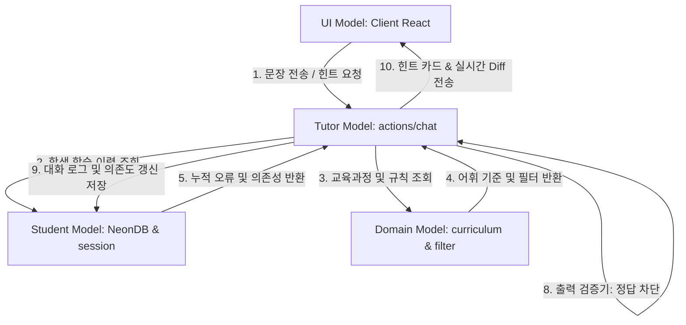

# 영어 작문 AI 스캐폴딩 튜터 - 통합 로드맵 및 검증 계획

본 문서는 영어 작문 교육 최신 연구 동향(지능형 튜터링 시스템, Fading 스캐폴딩, 과의존 방지, 피드백 리터러시)을 반영하여 개정된 제품 요구사항 정의서(PRD)에 맞춘 **Next.js 16+ App Router 및 NeonDB 기반 영어 작문 AI 스캐폴딩 튜터**의 통합 개발 로드맵과 세부 검증 계획입니다.

---

## 1. 지능형 튜터링 시스템(ITS) 기반 아키텍처 및 레이어별 절대 준수 정의

본 애플리케이션은 단순 AWE(자동 첨삭)를 넘어선 지능형 튜터링 시스템(ITS) 4대 요소의 유기적 통신 구조를 갖추며, 개발 과정 전반에서 각 레이어의 책임 경계와 개발 규칙은 **절대적으로 준수**되어야 합니다.

### 1.1 Domain Model (도메인 모델 레이어)
* **정의**: 습득해야 할 교과 지식(영어 작문)의 어휘, 문법 규칙, 전문가의 문제 해결 경로를 캡슐화한 전문가 지식 베이스(Expert Knowledge Base)입니다.
* **핵심 특징**: 학생의 입력 문장을 진단하여 문장 속 오류 및 불일치 요소를 감지하는 비교 기준 역할을 수행합니다.
* **구현 범위**:
  - `curriculumData.ts`: 학년별 필수 영단어 사전 및 예문 템플릿 정보 관리.
  - `safetyFilter.ts`: AI 튜터의 정답 제공 차단 및 학년 수준 비적합 용어 필터링.
* **⚠️ 절대 준수 지침**:
  - **정답 노출 방지(Zero Exposure)**: AI 응답에 완성형 정답 영문이 단 한 구절이라도 유출되는 것은 도메인 차원에서 전면 금지되며, 유출 시 출력 검증기(Tutor Model)를 통해 대체 문구로 치환되어야 합니다.
  - **교육과정 범위 준수**: 힌트 단어 제공 시 초등 어휘 풀(`curriculumData.ts`)에 명시된 범위 밖의 단어를 우선 추천하지 않도록 엄격하게 제한합니다.

### 1.2 Student Model (학생 모델 레이어)
* **정의**: 학습자의 인지적/정의적 상태(지식수준, 누적오류, 수정 행위 패턴, 과의존도)를 지속적으로 갱신하고 추적하는 프로파일링 엔진입니다.
* **핵심 특징**: 학습자의 근접발달영역(ZPD)을 모델링하여 학습의 한계와 성장을 정량적으로 감지합니다.
* **구현 범위**:
  - NeonDB Schema: `students`, `writing_sessions`, `conversation_logs` 테이블.
  - `writing_sessions` 내의 `reflection_text`(자기반성 내용) 및 `is_overdependent`(과의존 여부) 컬럼.
  - `conversation_logs` 내의 `detected_errors`(학생의 누적 오류 카테고리) 컬럼.
* **⚠️ 절대 준수 지침**:
  - **실시간 프로파일링 갱신**: 대화가 진행될 때마다 힌트 사용 패턴과 오류 유형을 DB에 누적 기록하여 학습 데이터의 단절을 방지합니다.
  - **과의존 판정 영속화**: 한 세션에서 4~5단계 힌트 연속 2회 이상 사용 감지 시, 해당 플래그를 Student Model에 반드시 참(`true`)으로 영속화하여 교사 모니터링에 누락이 없게 합니다.

### 1.3 Tutor Model (튜터 모델 레이어)
* **정의**: Student Model의 현재 상태와 Domain Model의 규칙에 근거하여 **"어떤 시점에, 어느 강도의 스캐폴딩(힌트)을 제공할 것인가"**를 판단하고 수행하는 교수학습 의사결정(Decision-Making) 엔진입니다.
* **핵심 특징**: 도움을 주는 것을 넘어, 학습자의 실력이 향상됨에 따라 도움을 점진적으로 줄여가는 **Fading(책임 이양)** 원칙을 주관합니다.
* **구현 범위**:
  - `promptBuilder.ts`: 5단계 힌트 프롬프트 템플릿 빌더.
  - `actions/chat.ts`: OpenAI API 연동 및 스캐폴딩 단계(1~5단계)의 가변적 조율 엔진.
* **⚠️ 절대 준수 지침**:
  - **Hattie 피드백 포맷 준수**: AI 튜터의 대답은 평가적 어조를 지양하고 반드시 "목표 문장(Where to go) ➡️ 현재 상태(How to go) ➡️ 구체적 수정 힌트(Where next)"의 3단계 비평가적 구조로 피드백을 전달해야 합니다.
  - **동적 Fading 메커니즘**: 학생이 4~5단계 힌트를 적용한 뒤 오류를 유의미하게 수정하여 문장 상태가 진전되면, 다음 대화 턴의 힌트 강도를 2~3단계(가벼운 개념/오류 위치 힌트)로 강등시켜 스스로 힘으로 작성하도록 지원을 Fading해야 합니다.

### 1.4 UI Model (사용자 인터페이스 레이어)
* **정의**: 학습자(학생/교사)와 지능형 시스템 간의 HCI(Human-Computer Interaction)를 활성화하고, 수정 과정의 메타인지 및 데이터 투명성(Learning Analytics)을 시각화하는 프론트엔드 레이어입니다.
* **핵심 특징**: 단순 텍스트 출력을 넘어 수정 행위 비교(Diff) 및 반성 행동(Reflection)을 이끌어내는 도구를 렌더링합니다.
* **구현 범위**:
  - `ChatInterface.tsx` / `DiffVisualizer.tsx`: 단어 수준의 실시간 Diff(추가: 초록, 삭제: 빨강) 시각화.
  - `ReflectionForm.tsx`: 작문 완료 후 선택형 성장 태그 카드 및 선택적 자기반성 소감 입력란.
  - `TeacherDashboard.tsx` (`/teacher`): 학급 학생들의 진행률 및 과의존 학생(⚠️) 최상단 강조 배치 뷰.
* **⚠️ 절대 준수 지침**:
  - **자기반성 루프 강제화**: 학생은 최소 1개 이상의 성장 태그 카드를 선택하기 전에는 세션을 종료할 수 없도록 UI 입력을 제한하고, 주관식 소감(`reflection_text`)은 선택 사항으로 제공해야 합니다.
  - **실시간 메타인지 시각화**: 학생이 입력 창에 수정 문장을 작성할 때마다 이전 문장과의 비교 정보를 화면에 실시간 노출하여 자신이 고친 패턴을 시각적으로 인지할 수 있도록 보장해야 합니다.

---

### 1.5 ITS 모델 간 상세 결합 아키텍처



### 1.6 ITS 모델별 추천 개발 및 연동 순서
개발 효율성을 극대화하기 위해 백엔드 핵심 엔진을 먼저 구축하고 프론트엔드 UI를 결합하는 **데이터 ➡️ 비즈니스 ➡️ UI** 탑다운-바텀업 샌드위치 순서로 개발을 진행합니다.

1. **[1단계] Domain & Student Model의 뼈대 수립 (완료)**
   * NeonDB 테이블 정의 및 마이그레이션 완료.
   * `curriculumData.ts`, `safetyFilter.ts` 초기 버전 구현 완료.
   * `session.ts` Server Action을 통한 학생 프로필 데이터 생성 완료.
2. **[2단계] Tutor Model 핵심 로직 구축 (Phase 3 진행 사항)**
   * `actions/chat.ts` 백엔드 액션을 신설하고, OpenAI API 연동 및 `promptBuilder`와 `safetyFilter`를 통합.
   * 데이터가 없는 상태에서도 힌트를 던져줄 수 있는 챗봇 코어 엔진 완성.
3. **[3단계] Tutor-Student 모델 데이터 연동 (Phase 3 진행 사항)**
   * `actions/chat.ts`가 호출될 때 DB에서 이전 `conversation_logs`를 긁어와 4~5단계 힌트 연속 2회 여부를 판단하여 `is_overdependent` 플래그를 업데이트하는 과의존 탐지 엔진 탑재.
   * 학생이 이전에 성공한 유형이 있으면 힌트 단계를 조절하는 동적 Fading 알고리즘 구현.
4. **[4단계] UI Model (프론트엔드) 조립 및 실시간 시각화 (Phase 3 ~ 4 진행 사항)**
   * 백엔드 액션(`chat.ts`)이 준비되면, `ChatInterface.tsx` 및 `DiffVisualizer.tsx` 컴포넌트를 조립하여 데이터 바인딩.
   * 작문 성공 시 나타나는 `ReflectionForm.tsx`를 구현하고 반성문 전송 시 `reflection_text`를 `writing_sessions` 테이블에 업데이트.
5. **[5단계] UI Model - 교사용 대시보드 (`/teacher`) 완성 (Phase 5 진행 사항)**
   * `Student Model`에 누적되어 기록된 학생 메타데이터(`is_overdependent`, `reflection_text`, `detected_errors`)를 모아서 그리드/테이블 뷰로 렌더링.

---

## 2. 제안하는 프로젝트 구조 (개정 반영)
```text
src/
├── app/
│   ├── layout.tsx                        # 루트 레이아웃 (공통 폰트, 파스텔톤 배경 지정)
│   ├── page.tsx                          # 학생 입장 화면 (RSC)
│   ├── actions/                          # Next.js Server Actions
│   │   ├── session.ts                    # 세션 및 학생 계정 갱신, 자기반성(reflection_text) 저장
│   │   └── chat.ts                       # AI 대화 루프, Hattie 프롬프트, Fading 제어, 과의존 판별
│   ├── writing/
│   │   ├── page.tsx                      # 작문 페이지 컨테이너 (RSC)
│   │   └── _components/                  # 작문 화면 전용 클라이언트 컴포넌트
│   │       ├── ChatInterface.tsx         # 대화 흐름 및 실시간 Diff 연동 컨테이너
│   │       ├── MessageBubble.tsx         # 학생/AI 발화 및 힌트 단계 카드 렌더링
│   │       ├── WritingInput.tsx          # 입력창 및 힌트 요청 버튼
│   │       └── DiffVisualizer.tsx        # [신규] 이전/현재 입력문 단어 단위 실시간 Diff UI
│   ├── result/
│   │   └── [sessionId]/
│   │       ├── page.tsx                  # 세션 결과 및 피드백 리터러시 완료 폼 (RSC)
│   │       └── _components/              # 결과 및 반성 컴포넌트
│   │           ├── GrowthVisualizer.tsx  # 단어 수 증가 게이지
│   │           └── ReflectionForm.tsx    # 자기반성문(reflection_text) 입력 및 전송
│   ├── teacher/                          # [신규] 교사 전용 라우트
│   │   ├── page.tsx                      # 전체 학급 학습 진행 현황판 (RSC)
│   │   └── _components/
│   │       └── TeacherDashboard.tsx      # 과의존 학생(⚠️) 경고 강조 및 반성문 리스트 뷰
│   └── components/                       # 전역 공유 공통 UI 컴포넌트
├── lib/
│   ├── db.ts                             # NeonDB 연결 헬퍼 및 쿼리 처리
│   ├── promptBuilder.ts                  # Hattie 피드작 템플릿 및 Fading 규칙 포함 프롬프트 빌더
│   ├── safetyFilter.ts                   # 완성형 정답 및 초등 비적합 문법 용어 필터링 검증기
│   └── curriculumData.ts                 # 초등 교육과정 필수 단어 및 표준 예문 리스트
```

---

## 3. 통합 로드맵 및 단계별 검증 계획

```mermaid
gantt
    title 영어 작문 AI 스캐폴딩 튜터 통합 개발 마일스톤
    dateFormat  YYYY-MM-DD
    section 인프라 및 설계
    Phase 0: 프로젝트 초기화 및 DB 스키마 구축     :done, p0, 2026-05-30, 2d
    Phase 1: 백엔드 코어 모듈 (db/prompt/safety) 개발 :done, p1, after p0, 3d
    Phase 2: 학생 입장 흐름 & 세션 생성 개발       :done, p2, after p1, 2d
    section 작문 대화 및 시각화
    Phase 3: 작문 대화 핵심 피드백 루프 & 실시간 Diff :active, p3, after p2, 4d
    Phase 4: 세션 종료 & 피드백 리터러시 성장 태그 적용   : p4, after p3, 3d
    Phase 5: 교사 대시보드 (/teacher) 구현           : p5, after p4, 2d
    section 성장 뱃지 & 통합
    Phase 6: 성장 뱃지 획득 엔진 및 도감 UI 개발   :active, p6, after p5, 3d
    Phase 7: E2E 통합 검증 & Cloud Run 배포       : p7, after p6, 3d
    section 사용후기 및 관리자
    Phase 10: 사용후기 수집 및 제작자 대시보드 구축 : p10, after p7, 3d
```

### 1) Phase 0: 프로젝트 초기화 및 DB 스키마 구축 (완료)
* **상세 작업**: Next.js 16/React 19 기반 보일러플레이트 및 NeonDB 기본 테이블 구조 구축 완료.

### 2) Phase 1: 백엔드 코어 모듈 개발 (완료 - 마이그레이션 적용)
* **상세 작업**: 
  - `db.ts` 연결 웜업 및 쿼리 헬퍼 작성.
  - `curriculumData.ts` 필수 단어 연동.
  - `safetyFilter.ts` 정답 노출 방지 규칙 구현.
  - [prd.md](file:///d:/anaconda/source_code/WritingWithChatbot/docs/prd.md) 개정에 따른 **`writing_sessions` 및 `conversation_logs` 신규 컬럼 마이그레이션 적용**.
* **검증 방안**:
  - `test-phase1.ts`를 실행하여 데이터베이스 연결, 필터 모듈 작동, 기본 프롬프트 빌더 작동 확인 완료.
  - `check-tables.ts`를 실행하여 `reflection_text`, `is_overdependent`, `detected_errors` 컬럼이 NeonDB에 반영 완료되었음을 검증.

### 3) Phase 2: 학생 입장 흐름 & 세션 생성 개발 (완료)
* **상세 작업**: `page.tsx` 게이트 UI 및 `startSession` Server Action 작성 완료.
* **검증 방안**: `test-phase2.ts`를 통해 필수값 유효성 검사, 리다이렉트 예외 우회, 동명이인 재입장 시 계정 재사용 및 프로필 레벨 업데이트 로직 작동 검증 완료.

### 4) Phase 3: 작문 대화 핵심 피드백 루프 & 실시간 Diff 구현 (진행 예정)
* **상세 작업**:
  - `actions/chat.ts` Server Action 구현: GPT-4o-mini 호출 시 **Hattie 모델 피드백 양식** 및 **Fading 알고리즘**(학생 진전 시 5단계 ➡️ 2단계 강등) 통합.
  - **과의존 탐지 엔진**: 세션 내 4~5단계 힌트 연속 2회 호출 감지 시 `is_overdependent = TRUE` 업데이트 로직 추가.
  - `ChatInterface.tsx` 및 대화 컴포넌트 조립.
  - `DiffVisualizer.tsx` 컴포넌트 개발: 학생이 문장을 보낼 때마다 이전 문장과 현재 문장을 단어 단위로 비교하여 추가(초록색), 삭제(빨간색 취소선)를 실시간 렌더링.
* **검증 방안**:
  - **Fading 검증**: 모의 세션에서 학생이 5단계 빈칸 힌트 적용 후 올바른 과거 시제를 입력했을 때, 다음 턴의 `hint_level`이 다시 2단계 수준으로 완화되어 제공되는지 확인.
  - **과의존 플래그 검증**: 5단계 힌트를 연속 2회 요청하는 시나리오를 가상 테스트하여 `writing_sessions.is_overdependent` 컬럼이 참(`true`)으로 바뀌는지 데이터베이스 쿼리를 통해 검증.

### 5) Phase 4: 세션 종료 & 피드백 리터러시 성장 태그 적용
* **상세 작업**:
  - `result/[sessionId]/page.tsx` 및 `ReflectionForm.tsx` 컴포넌트 개발.
  - 작문 성공 판정 시 바로 완료되지 않고, 최초 문장과 최종 완성 문장을 실시간 Diff로 비교하는 화면 표시.
  - **성장 태그 선택 및 선택적 소감 처리**: 학생이 학습을 마칠 때 성장한 영역(어휘, 어순, 문법, 유능감)을 나타내는 성장 태그 카드를 최소 1개 이상 선택하도록 하며, 추가적인 소감은 '직접 쓸래요' 방식을 통해 선택적으로 입력할 수 있게 한 후 세션을 완료 상태로 전환.
* **검증 방안**:
  - 성장 태그가 하나도 선택되지 않은 상태에서 완료 버튼을 클릭할 시 에러 경고 토스트와 함께 진행이 차단되며, 태그를 최소 1개 이상 선택하고 제출했을 때만 `completed_at` 타임스탬프와 `reflection_tags`(선택적 `reflection_text` 포함)가 저장되는지 확인.

### 6) Phase 5: 교사 대시보드 (`/teacher`) 구현
* **상세 작업**:
  - `/teacher/page.tsx` 및 `TeacherDashboard.tsx` 구현.
  - 전체 학생 리스트에서 학생별 누적 시도 횟수, 평균 수정 횟수 시각화.
  - **과의존 학생 시각화**: `is_overdependent`가 참인 학생 레코드를 목록 최상단에 ⚠️ 아이콘 및 붉은색 보더로 강조 표시.
  - 학생들의 오류 카테고리(`detected_errors`) 분포 차트 구현 및 자기반성문(`reflection_text`) 아코디언/카드 형식으로 모아보기 기능 렌더링.
* **검증 방안**:
  - 임의의 학생 세션 5개를 완료(이 중 2개는 과의존 플래그 활성화)시킨 후, `/teacher` 대시보드 진입 시 과의존 학생이 상단에 배치되고 경고 플래그가 정확히 표시되는지 브라우저 테스트 진행.

### 7) Phase 6: 성장 뱃지 획득 엔진 및 도감 UI 개발
* **상세 작업**:
  - `student_badges` 테이블 마이그레이션 적용 및 `completeSession` 내 뱃지 판별/지급 엔진 탑재.
  - 학생 입장 홈화면 하단에 누적 획득 뱃지 도감 컴포넌트 개발.
  - 교사 대시보드 상세 보기 모달 내에 해당 학생의 수집 뱃지 목록 연동 시각화.
* **검증 방안**:
  - `scripts/test-phase6.ts`를 작성하여 각 뱃지별 획득 조건(수정 횟수, 단어 길이, 힌트 수위, 소감 글자수 등)을 충족했을 때 DB에 중복 없이 정확히 기입되는지 테스트.

### 8) Phase 7: E2E 통합 검증 & Cloud Run 배포
* **상세 작업**: 
  - Chromebook, 태블릿 터치 브라우저 대상 UI 둥근 모서리 및 파스텔톤 레이아웃 깨짐 검사.
  - Google Cloud Run 배포 및 Docker Standalone 빌드 E2E 검증.

### 9) Phase 8: 고등학생(High School) 수준 추가 개발 (신규)
* **상세 작업**:
  - `curriculumData.ts`에 고교 표준 성취기준 어휘/문법/예문 템플릿 정보 구축.
  - `promptBuilder.ts`에 고등 레벨 시스템 프롬프트(공식 문법 용어 활용, 전문적인 지적 튜터 톤) 반영.
  - `session.ts`에 고등 수준 난이도 불일치 검사 추가 및 '지나치게 고난도(Academic Mismatch)'와 '지나치게 저난도(Under-challenge Mismatch)' 두 가지 불일치를 감지하는 양방향 중재 로직 설계.
  - `StudentEntryForm.tsx`에 보라색 테마의 "고등학생" 선택 카드 UI 배치 및 모달 안내 문구 고도화.
  - 작문/결과/교사 대시보드 뷰 한글 변환 분기 처리 갱신.
* **검증 방안**:
  - `scripts/test-high-school.ts`를 구현하여 고등 레벨 챌린지의 불일치 모달 트리거(Under-challenge / Academic level) 및 작문 생성 흐름 검증.

### 10) Phase 10: 사용후기(Feedback) 수집 및 제작자 대시보드 구축
* **상세 작업**:
  - **DB 스키마 구성**: Neon DB에 `feedbacks` 테이블 생성.
  - **백엔드 구현**: 피드백 생성 및 집계/목록 조회를 위한 Server Action(`actions/feedback.ts`) 개발.
  - **학생용 설문 UI**: 최종 결과 페이지([ResultPage](file:///d:/anaconda/source_code/WritingWithChatbot/src/app/result/[sessionId]/page.tsx))에 후기 남기기 버튼 추가 및 별점(Hover & Click 인터랙티브 UI)과 서술형 입력을 지원하는 `FeedbackModal` 컴포넌트 개발. 제출 완료 시 진심 어린 감사의 글귀를 모달 내에 노출.
  - **제작자용 비밀 대시보드**: `/feedback` 엔드포인트에 진입 시, 전체 만족도 평균 및 만족도 점수 분포 바 그래프, 개별 피드백 테이블 뷰를 출력하는 대시보드 UI 구현.
* **검증 방안**:
  - 결과 화면에서 후기 버튼 노출 및 모달의 인터랙티브 별점(Hover에 반응하는 별 개수 변경 및 Click 고정) 기능 검증.
  - 제출 완료 후 Neon DB의 `feedbacks` 테이블에 정상 입력되는지 및 감사의 글귀가 팝업되는지 확인.
  - 주소창에 `/feedback`을 수동 입력하여 어드민 대시보드로 성공적으로 진입하고, 평점 분포 및 데이터가 실시간 집계되어 렌더링되는지 브라우저 테스트 진행.

---

## 4. 향후 확장 기획 (개정 반영)
1. **Web Speech API (TTS 듣기 힌트)**:
   * 읽기 능력이 다소 부족하여 텍스트 힌트에 쉽게 지루함을 느끼는 하위권 초등학생(3~4학년)을 위해, 힌트 카드 옆 스피커 아이콘을 클릭하면 원어민 목소리로 영어 힌트를 재생해주는 듣기 스캐폴딩 지원.
2. **다중 과제(Topic) 선출제**:
   * 교사가 `/teacher` 대시보드에서 오늘의 작문 과제(우리말 문장 세트)를 여러 개 생성하고 학생들의 첫 시작 화면에 이를 노출시켜 과제를 배포하는 기능.
